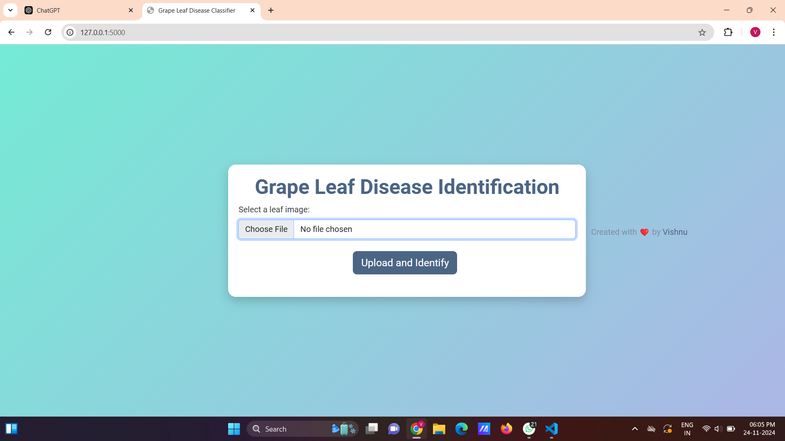
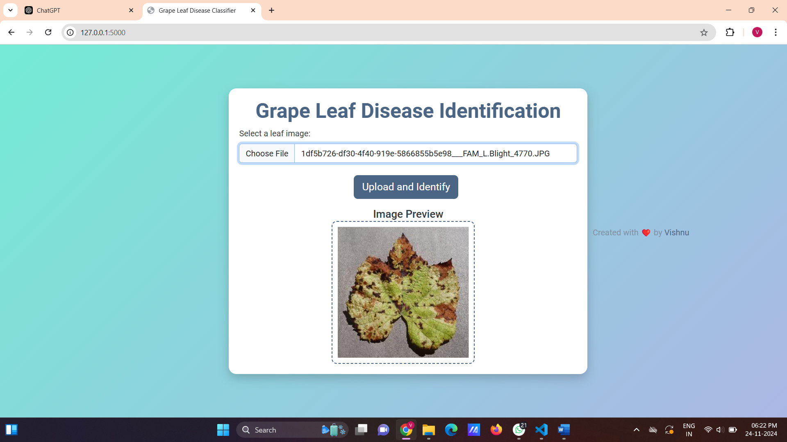
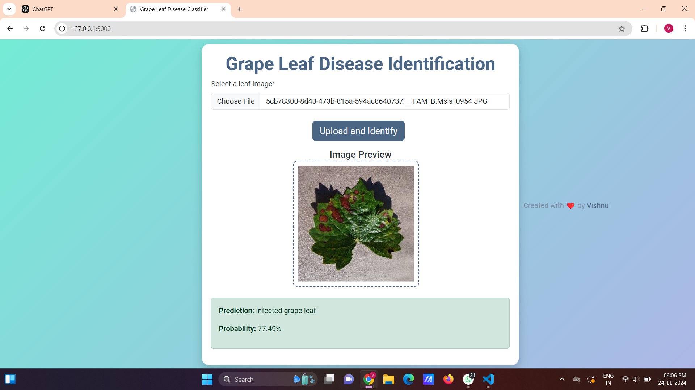

# Grape Leaf Disease Identification using CNN and HBA Algorithm

A web application that predicts whether a grape leaf is healthy or infected using the (https://github.com/Vishnu3719/Dataset.git) from this git_id. The application is built using Flask for both frontend and backend.

---

## Features
- Upload an image of a grape leaf.
- Get predictions on whether the leaf is healthy or infected.
- View a preview of the uploaded image before submission.

---

## Screenshots
### Home Page


---

## Installation

### Prerequisites
Ensure you have Python installed (version 3.7 or above). You can download it from [Python's official website](https://www.python.org/).

### Steps
1. Clone this repository:
   ```bash
   git clone https://github.com/VishnuvarthanK/Grape-leaf-disease-identification-using-CNN-and-HBA-algorithm.git
2. Install dependencies:
   ```bash
   pip install -r requirements.txt
3.Download Dataset in kaggle or other 
    Create an folder name as dataset and upload the file in given order

    ```dataset\train\healthy and infected - 2 folders
    ```create an onmore folder name as modelsin same dir
    
4. Train the dataset to run the file
   ```bash
   python train_cnn.py
   ```after creating model_cnn.pth
5. Run the application
   ```bash
   python app.py

## Output



